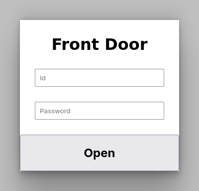
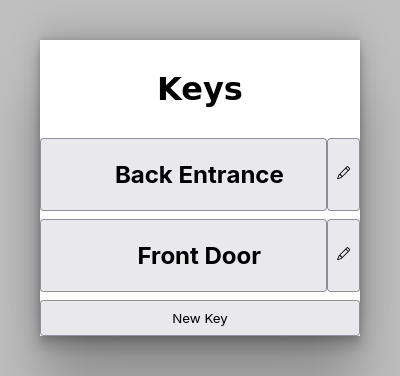

# Door Lock

A MicroPython-based web interface for controlling door access using
TOTP (Time-Based One-Time Password) authentication.
This system allows users to unlock doors via a browser-based interface.

## Screenshots






## Prerequisites

### Hardware

* Raspberry Pi Pico W
* Relay module (e.g., for controlling a door lock mechanism)

### Software

* [Thonny IDE](https://thonny.org/) or similar for editing and
  uploading files to Raspberry Pi Pico

## Installation

### Prepare the Pi Pico

Install MicroPython by following the [official guides](https://www.raspberrypi.com/documentation/microcontrollers/micropython.html)
for you specific hardware.

### Copy Files to Pi Pico

Transfer the following files to the root directory
(using Thonny IDE or similar):

* `base.css`
* `config.py`
* `icon.png`
* `main.py`

Create a `lib` folder within the root directory and copy the following
libraries there:

* [totp](https://github.com/eddmann/pico-2fa-totp):
  Copy the folder `totp` into the `lib` directory
* [microdot](https://github.com/miguelgrinberg/microdot):
  Copy the files `scr/microdot/__init__.py` and `src/microdot/microdot.py`
  into the `lib/microdot` directory.

### Configure settings

Open the file `config.py` and set your WIFI credentials, hostname,
TOTP secret keys, and relay pin:

```python
# Example
TITLE = 'Front Door'
WIFI_SSID = 'your ssid'
WIFI_PASSWORD = 'your password'
HOSTNAME = 'front-door'
WIFI_COUNTRY = 'it'
SECRETS = {
    '': '6fvjwuo7gkrlygu7onzmu4uqkbuz5mbg',
    'other id': 'dk3fq6lok3q67ec4pdy6p2kmdddmufu2',
}
PIN = 0
```

## Usage

### Using the Web Interface

Connect to the device using a web browser at `http://<hostname>`.
Replace `<hostname>` with the value set in `config.py`.

Generate the TOTP Password. Enter the id and the password.
Upon successful authentication, the door lock will be temporarily unlocked.

### Managing Doors with PWA

The [Manager PWA](https://unrud.github.io/door-lock) allows users
to manage multiple door locks from their devices.
